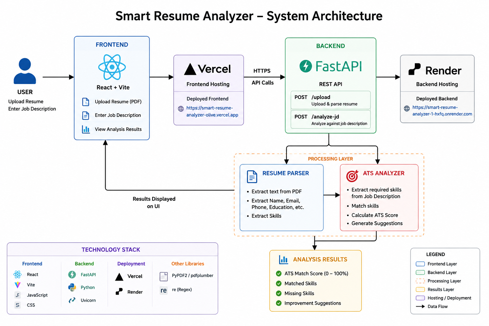
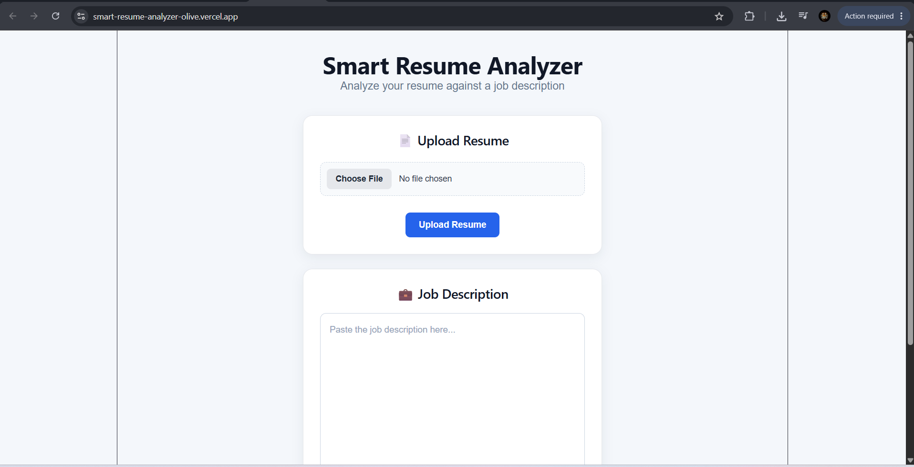
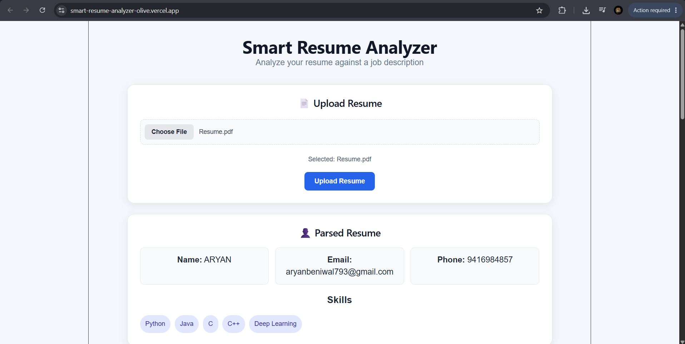
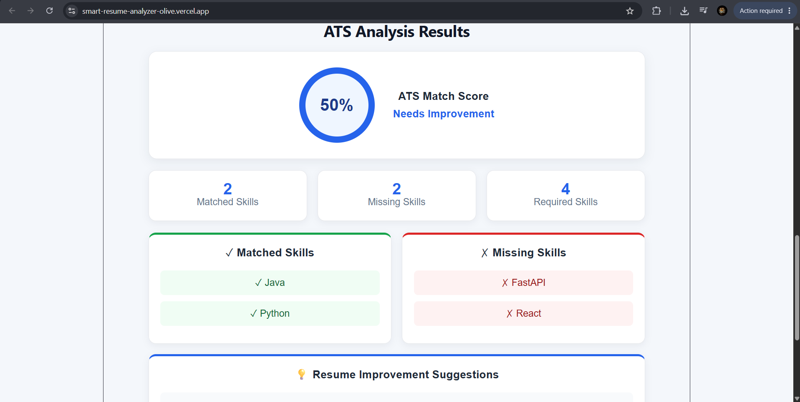

# Smart Resume Analyzer

A full-stack web application that analyzes resumes against job descriptions and provides an ATS-style match score, matched skills, missing skills, and improvement suggestions.

## Live Demo

https://smart-resume-analyzer-olive.vercel.app

## Features

- Upload resume in PDF format
- Extract candidate information from resume
- Extract skills from resume
- Analyze resume against a job description
- Calculate ATS match score
- Identify matched skills
- Identify missing skills
- Provide resume improvement suggestions
- REST API built with FastAPI
- React-based frontend
- Production deployment using Vercel and Render

## Tech Stack

### Frontend
- React
- Vite
- JavaScript
- CSS

### Backend
- Python
- FastAPI
- Uvicorn

### Resume Processing
- PDF text extraction
- Skill extraction
- Rule-based ATS matching

### Deployment
- Vercel — Frontend
- Render — Backend
- GitHub — Source Code Management

## Project Architecture


```text
                    Smart Resume Analyzer
                            |
             +--------------+--------------+
             |                             |
             v                             v
      React Frontend                FastAPI Backend
          (Vercel)                     (Render)
             |                             |
             |       REST API              |
             +---------------------------->|
                                           |
                              +------------+------------+
                              |                         |
                              v                         v
                       Resume Parser              ATS Analyzer
                              |                         |
                              v                         v
                       Resume Data          Score + Skill Matching
                              |                         |
                              +------------+------------+
                                           |
                                           v
                                  Analysis Results

## Screenshots

### Homepage



### Resume Analysis



### ATS Analysis Results

